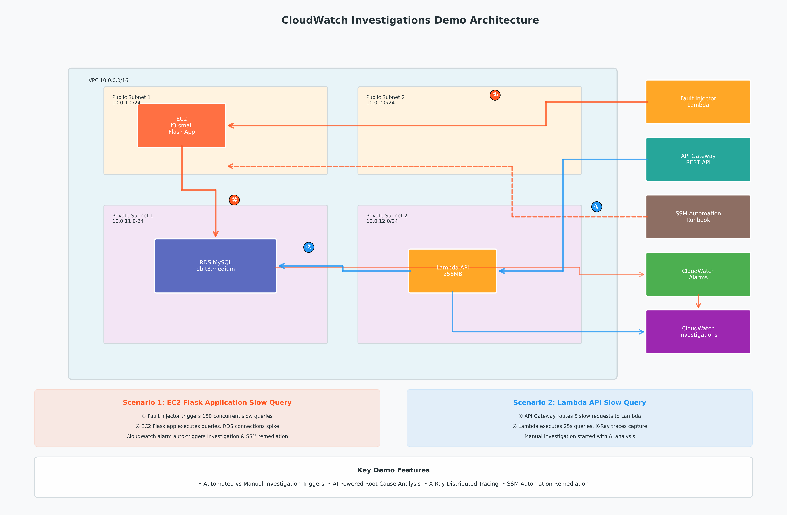
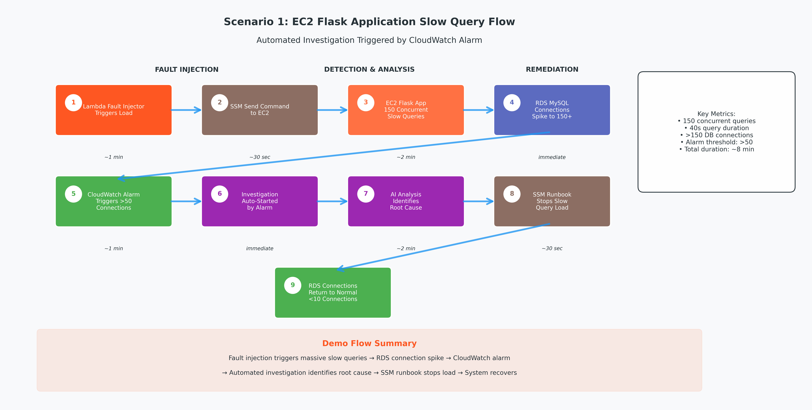
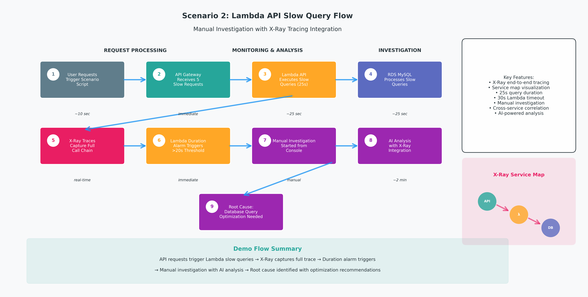

# CloudWatch Investigations Demo

CloudWatch Investigations 功能演示环境，展示 AI 驱动的运维能力。

## 目录
- [架构说明](#架构说明)
- [快速开始](#快速开始)
- [演示场景](#演示场景)
- [故障排查](#故障排查)
- [成本和区域](#成本和区域)

---

## 架构说明

### 系统架构总览



### 部署的资源

```
VPC (10.0.0.0/16)
├── Public Subnets (10.0.1.0/24, 10.0.2.0/24)
│   └── EC2 (t3.small)
│       ├── Flask 应用（后台运行）
│       └── 慢查询端点（场景1使用）
│
├── Private Subnets (10.0.11.0/24, 10.0.12.0/24)
│   ├── RDS MySQL (db.t3.medium)
│   └── Lambda API (256MB, VPC 内)
│
├── Lambda Fault Injector (256MB, VPC 外)
│   └── 通过 SSM 向 EC2 发送命令
│
├── SSM Automation Document
│   └── RemediateRDSHighConnections
│
└── API Gateway
    └── 路由到 Lambda API
```

**资源说明**:  
- **EC2**: 部署了 Flask 应用，提供慢查询端点，场景1使用  
- **RDS**: MySQL 数据库，场景1和场景2共用  
- **Lambda API**: 在 VPC 内，连接 RDS，已启用 X-Ray 追踪，场景2使用  
- **Lambda Fault Injector**: 在 VPC 外，通过 SSM Send Command 在 EC2 上触发慢查询负载，场景1使用  
- **SSM Automation Document**: 自动修复 Runbook，停止 EC2 上的慢查询负载，场景1使用  
- **API Gateway**: 提供 HTTP 接口，路由到 Lambda API，场景2使用

### 应用架构

#### 架构 A: EC2 Flask 应用（场景1使用）
```
Lambda Fault Injector → EC2 Flask → RDS MySQL
```
- Lambda Fault Injector 触发 EC2 发起并发慢查询请求
- 用于演示数据库连接堆积问题

#### 架构 B: Lambda API（场景2使用）
```
User Requests → API Gateway → Lambda API → RDS MySQL
```
- Lambda 函数直接连接 RDS
- 用于演示 Lambda 慢查询问题


### 场景与架构对应

| 场景 | 使用架构 | 调用链 | 涉及服务 |
|------|---------|--------|---------|
| 场景1: EC2 应用慢查询 | 架构 A | Fault Injector → SSM → EC2 → RDS | EC2, RDS |
| 场景2: Lambda 慢查询 | 架构 B | API Gateway → Lambda → RDS | Lambda, RDS |

---

## 快速开始

### 前置条件
- AWS CLI 已配置，有管理员权限
- 区域: us-east-1 其他支持 CloudWatch Investigations 的区域

### 部署步骤

```bash
# 1. 部署基础设施（15-20分钟）
./deploy.sh
#    自动完成：
#    - CloudFormation 部署所有资源
#    - EC2 UserData 安装依赖并创建 Flask 应用
#    - Flask 应用启动时自动初始化数据库

# 2. 配置 Investigation 集成（1分钟）⭐ 必需步骤
./setup-investigation.sh
#    作用：
#    - 创建/检测 Investigation Group
#    - 配置 Investigation Group 资源策略
#    - 配置场景1的 RDS 连接数告警自动触发 Investigation
#    - 场景2保持手动启动

# 3. 验证部署（可选）
./verify-deployment.sh

# 4. 运行演示场景
./scenarios/scenario-1.sh  # 推荐主演示
```

**重要说明**：
- `setup-investigation.sh` 必须在 `deploy.sh` 之后运行
- 它会配置场景1的告警自动触发 Investigation
- 场景2需要从控制台手动启动 Investigation
- Investigation Group 每个 Region 只能有一个，脚本会自动检测并使用现有的

### 清理资源

```bash
./cleanup.sh  # 5-10分钟完成
```

---

## 演示场景

### 场景1: EC2 应用慢查询（推荐主演示）⭐



**时长**: 8分钟  
**核心功能**: 告警自动触发 + AI 分析 + 手动修复

#### 运行步骤

```bash
# 1. 启动场景
./scenarios/scenario-1.sh

# 2. 等待 2-3 分钟
#    - EC2 Flask 应用发起 150 个并发慢查询
#    - RDS 连接数飙升到 150+
#    - 告警自动触发
#    - Investigation 自动启动

# 3. 打开 Investigation 控制台（从部署输出获取链接）
#    - 查看 AI 分析和根因假设
#    - 查看 EC2 → RDS 跨服务关联
#    - 根因：数据库慢查询导致连接堆积

# 4. 执行修复
./scenarios/stop-load.sh

# 5. 验证 RDS 连接数恢复正常，生成事件报告
```

#### 关键演示点
- ✅ 告警自动触发 Investigation
- ✅ AI 自动分析 RDS 连接数异常
- ✅ 跨服务关联（EC2 应用 → RDS）
- ✅ 生成根因假设
- ✅ SSM Automation 自动修复建议
- ✅ 手动执行修复（脚本或 SSM Runbook）
- ✅ 完整的事件报告

#### 注意事项
- 慢查询负载持续 30 分钟后自动停止
- 也可以手动运行 `./scenarios/stop-load.sh` 提前停止
- 每个查询延迟 40 秒，150 个并发请求
- 负载会每 35 秒发起一批新的 150 个并发请求，持续保持高连接数

### 场景2: Lambda 慢查询



**时长**: 5分钟  
**核心功能**: 手动启动 + X-Ray 追踪 + 跨服务分析

#### 运行步骤

```bash
# 1. 触发场景
./scenarios/scenario-2.sh
#    脚本会自动发送 5 个慢查询请求

# 2. 等待 2-3 分钟
#    让指标数据填充到 CloudWatch

# 3. 手动启动 Investigation
#    - 打开 Lambda 控制台 → cw-investigations-demo-api
#    - 点击 Monitor 标签
#    - 查看 Errors 或 Duration 指标峰值
#    - 点击 Investigate 按钮
#    - 选择时间范围（最近 15 分钟）
#    - 输入标题并启动

# 4. 查看 X-Ray 追踪
#    - 点击 X-Ray trace 链接
#    - 查看服务地图: API Gateway → Lambda → RDS
#    - 查看 trace 详情: RDS 查询耗时 ~25 秒
#    - Lambda 超时设置 30 秒，查询接近超时触发告警

# 5. 查看 AI 分析
#    - Root Cause: "Database query taking too long"
#    - 建议: 优化查询、增加超时、异步处理

# 6. （可选）使用 Amazon Q Chat
#    - 点击 AWS 控制台的 Amazon Q 图标
#    - 提问: "Why is cw-investigations-demo-api lambda function slow?"
#    - Amazon Q 会分析并建议启动 Investigation
```

#### 关键演示点
- ✅ 手动启动 Investigation
- ✅ X-Ray 端到端追踪
- ✅ 跨服务关联（Lambda → RDS）
- ✅ 聊天界面交互
- ✅ AI 识别数据库查询瓶颈

#### 关键观察点
- Lambda 超时设置: 30 秒
- 数据库查询延迟: 25 秒（接近超时，触发告警）
- X-Ray 显示完整调用链
- Investigation 关联监控信息

---

## 常用命令

```bash
# 查看所有资源
aws cloudformation describe-stacks --stack-name cw-investigations-demo \
  --query 'Stacks[0].Outputs' --output table

# 停止负载测试
./scenarios/stop-load.sh

# 查看 Lambda 日志
aws logs tail /aws/lambda/cw-investigations-demo-api --follow

# 检查 SSM Agent
aws ssm describe-instance-information \
  --filters "Key=tag:Name,Values=cw-investigations-demo-ec2"

# 查看 Investigation
aws aiops list-investigations \
  --investigation-group-arn <ARN>
```

---

## 成本和区域

### 成本估算
- **运行**: ~$3.0/天 (~$0.13/小时)
- **演示**: ~$0.20 (20分钟)
- **Investigation**: 免费 (150次/月内)

**成本明细**:
- EC2 t3.small: ~$0.021/小时
- RDS db.t3.medium: ~$0.068/小时
- RDS Performance Insights (Advanced): ~$0.018/小时
- Lambda + API Gateway: ~$0.01/小时
- 其他 (VPC, CloudWatch): ~$0.02/小时

### 支持区域
us-east-1 | us-west-2  

---

## 文件说明

```
├── README.md                    # 本文件（完整指南）
├── deploy.sh                    # 一键部署
├── setup-investigation.sh       # 配置 Investigation 集成
├── cleanup.sh                   # 一键清理
├── verify-deployment.sh         # 部署验证
├── cloudformation/
│   └── demo-stack.yaml          # 基础设施（30+资源，含 SSM Runbook）
├── app/                         # 应用代码
│   ├── ec2-app.py               # EC2 Flask 应用
│   ├── lambda-api.py            # Lambda API 函数
│   └── fault-injector.py        # 故障注入 Lambda
└── scenarios/                   # 场景触发脚本
    ├── scenario-1.sh
    ├── scenario-2.sh
    └── stop-load.sh
```

---

## 功能对比

| 功能 | 场景1 | 场景2 |
|------|-------|-------|
| 告警触发 | ✅ 自动 | ❌ 手动 |
| AI 分析 | 自动 | 手动 |
| 手动/自动修复 | ✅ 脚本/SSM | ❌ |
| X-Ray 追踪 | ❌ | ✅ |
| 跨服务关联 | ✅ | ✅ |
| 聊天界面 | ❌ | ✅ |
| 报告生成 | ✅ | ✅ |

---  

> 注：该 Repo 所有内容及代码全部由 Kiro 生成。